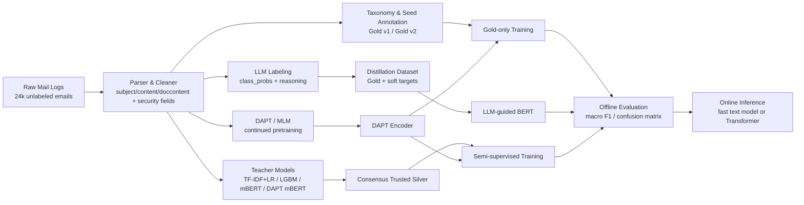
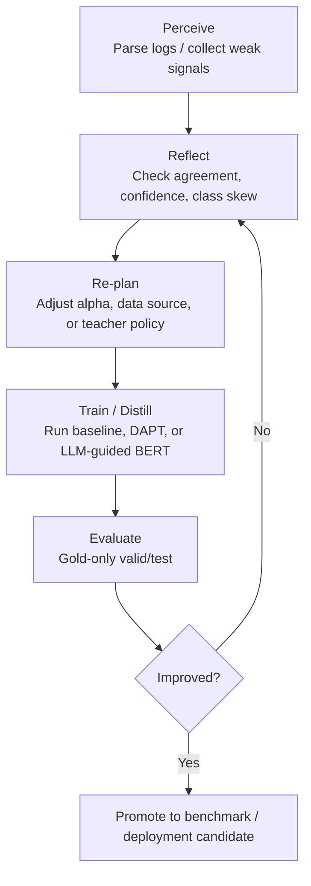

<div align="center">

```text
███████╗███╗   ███╗ █████╗ ██╗██╗     ███████╗ █████╗ ███████╗███████╗████████╗██╗   ██╗
██╔════╝████╗ ████║██╔══██╗██║██║     ██╔════╝██╔══██╗██╔════╝██╔════╝╚══██╔══╝╚██╗ ██╔╝
█████╗  ██╔████╔██║███████║██║██║     ███████╗███████║█████╗  █████╗     ██║    ╚████╔╝ 
██╔══╝  ██║╚██╔╝██║██╔══██║██║██║     ╚════██║██╔══██║██╔══╝  ██╔══╝     ██║     ╚██╔╝  
███████╗██║ ╚═╝ ██║██║  ██║██║███████╗███████║██║  ██║██║     ███████╗   ██║      ██║   
╚══════╝╚═╝     ╚═╝╚═╝  ╚═╝╚═╝╚══════╝╚══════╝╚═╝  ╚═╝╚═╝     ╚══════╝   ╚═╝      ╚═╝   
```

# EmailSafety

**Enterprise-grade email risk classification with weak supervision, DAPT, LLM distillation, and semi-supervised learning.**


</div>

## Table of Contents
- [Project Overview](#project-overview)
- [Key Features](#key-features)
- [Architecture Diagram](#architecture-diagram)
- [Why Adaptive-Agent?](#why-adaptive-agent)
- [Adaptive Logic](#adaptive-logic)
- [Performance Benchmark](#performance-benchmark)
- [Evaluation Matrix](#evaluation-matrix)
- [Repository Structure](#repository-structure)
- [Installation](#installation)
- [Usage](#usage)
- [Results and Artifacts](#results-and-artifacts)
- [Roadmap](#roadmap)
- [Limitations](#limitations)

## Project Overview
EmailSafety starts from a realistic enterprise constraint: **24k heterogeneous email logs, no official labels, noisy fields, and strong pressure to balance detection quality with inference efficiency**.

The repository turns that into a disciplined production-style loop:
- build a 5-class email risk taxonomy
- construct Gold datasets through seed annotation and targeted relabeling
- exploit full unlabeled traffic via **DAPT / MLM**
- generate **trusted silver** through multi-teacher consensus
- test **LLM-to-BERT distillation** under strict clean evaluation

Target taxonomy:
- `advertisement`
- `phishing`
- `impersonation`
- `malicious_link_or_attachment`
- `black_industry_or_policy_violation`

## Key Features
### Data Flywheel
- **Weak supervision bootstrap**: rules and LLM-assisted pre-annotation reduce cold-start labeling cost.
- **Human-in-the-loop correction**: Gold v1 -> Gold v2 via targeted relabeling on boundary and high-risk samples.
- **Full-corpus scoring**: the full 24k unlabeled corpus is repeatedly reused for DAPT, teacher prediction, silver mining, and error analysis.
- **Evaluation hygiene**: Silver stays in train only; valid/test remain Gold-only.

### Hybrid Feature Engine
- **Text features**: `subject + content + doccontent` concatenation, cleaning, and length-aware truncation.
- **Security metadata**: URL counts, suspicious TLDs, attachment counts, HTML tags, sender consistency, IP/region availability, recipient counts, whitelist counters.
- **Model fusion path**: classic TF-IDF baselines, structured-only LightGBM, multilingual BERT, and DAPT-enhanced Transformer.

### LLM-to-BERT Distillation
- LLM produces **class probability distributions** and **risk reasoning**.
- Distillation experiments show that **soft targets are useful only under tight weight control**.
- Best result comes from **soft-only distillation with low alpha**, not from naive joint hint + soft supervision.

## Architecture Diagram


## Why Adaptive-Agent?
This repository is **not an agent framework**, but it faces a similar systems problem: **static prompting and one-shot reasoning break under noisy enterprise inputs**.

Why naive ReAct-style logic fails in this domain:
- email payloads mix natural language, HTML noise, attachments, sender metadata, and routing artifacts
- long-tail security classes such as `impersonation` are easy to collapse into coarse labels like `advertisement`
- unrestricted LLM reasoning can look plausible while drifting away from Gold labels
- stronger supervision is not always better; noisy soft targets can actively damage downstream models

The project therefore uses an **adaptive closed loop** instead of a single “smart prompt”:
- inspect data quality first
- choose the right supervision source for each stage
- reweight weak signals instead of trusting them equally
- keep evaluation on clean Gold splits only

## Adaptive Logic


## Performance Benchmark
### Core Models
| Model | Features / Backbone | Test Macro F1 | Notes |
|---|---|---:|---|
| `text_only_lr` | TF-IDF on text | **0.6325** | strongest classic baseline |
| `text_plus_structured_lr` | TF-IDF + structured features | 0.6121 | fusion not yet better than text-only |
| `structured_only_lgbm` | security metadata only | 0.5220 | useful but insufficient alone |
| `multilingual_bert_base` | local mBERT | 0.6045 | clean Transformer baseline |
| `multilingual_bert_dapt` | mBERT + DAPT | 0.6088 | stable gain from unlabeled corpus |
| `gold_v2_only__dapt_multilingual_bert` | DAPT + Gold-only | 0.6122 | best semi-supervised backbone without silver |
| `soft_only_alpha01` | mBERT + LLM soft distillation | **0.6335** | best LLM-guided result |

### LLM Distillation Ablation
| Variant | Risk Hint | Soft Targets | Distill Alpha | Epochs | Test Macro F1 |
|---|---:|---:|---:|---:|---:|
| `plain_bert` | No | No | - | 3 | 0.6045 |
| `hint_only` | Yes | No | - | 3 | 0.5622 |
| `soft_only` | No | Yes | 0.5 | 3 | 0.4964 |
| `soft_only_alpha02` | No | Yes | 0.2 | 3 | 0.6031 |
| `soft_only_alpha01` | No | Yes | 0.1 | 3 | **0.6335** |
| `soft_only_alpha02_epoch5` | No | Yes | 0.2 | 5 | 0.5392 |
| `soft_only_alpha01_epoch5` | No | Yes | 0.1 | 5 | 0.5877 |
| `hint_plus_soft` | Yes | Yes | 0.5 | 3 | 0.4704 |

### Precision / Recall / Latency Snapshot
| System | Precision | Recall | Macro F1 | Relative Latency |
|---|---:|---:|---:|---|
| TF-IDF + LR | 0.6319 | 0.6398 | **0.6325** | lowest |
| mBERT | 0.6670 | 0.5823 | 0.6045 | medium |
| DAPT mBERT | 0.6472 | 0.5985 | 0.6088 | medium |
| LLM-guided mBERT (`alpha=0.1`) | 0.7090 | 0.6079 | **0.6335** | medium |

> Relative latency is reported qualitatively because the public repo does not ship deployment hardware traces. In enterprise settings, TF-IDF + LR is the fast path; Transformer variants are the high-accuracy path.

## Evaluation Matrix
| Noise Setting | Static Prompt / Strong Distill | Conservative Distill | Outcome |
|---|---|---|---|
| Low label noise | works | works | both acceptable |
| Moderate label noise | unstable | stable | weak distillation wins |
| High class skew | collapses tail classes | partially robust | thresholding matters |
| Long-tail security labels | over-smooths | better | Gold remains anchor |
| More epochs under noisy soft labels | degrades | still risky | stop early |

## Repository Structure
```text
configs/                  active configs
scripts/                  runnable entrypoints
src/email_safety/         reusable code
data/annotation/          Gold / silver / semi-supervised tables (private)
data/mlm_corpus/          MLM corpus artifacts (private)
outputs/final_summary/    public-facing summary artifacts
outputs/*                 local experiment outputs
archive/                  legacy scripts and configs
```

Detailed layout: [PROJECT_STRUCTURE.md](PROJECT_STRUCTURE.md)

## Installation
```bash
python -m venv .venv
source .venv/bin/activate
pip install -r requirements.txt
```

## Usage
### 1. Download local model from ModelScope
```bash
python scripts/download_model_from_modelscope.py \
  --model-id AI-ModelScope/bert-base-multilingual-cased \
  --cache-dir models
```

### 2. Build MLM corpus and run DAPT
```bash
python scripts/build_mlm_corpus.py \
  --input-path spam_email_data.log \
  --output-path data/mlm_corpus/mail_corpus.txt \
  --stats-json data/mlm_corpus/mail_corpus_stats.json

python scripts/train_dapt_mlm.py \
  --model-dir models/bert-base-multilingual-cased \
  --corpus-txt data/mlm_corpus/mail_corpus.txt \
  --output-dir outputs/dapt_multilingual_bert
```

### 3. Configure LLM API for automatic labeling
```bash
export DEEPSEEK_API_KEY="YOUR_API_KEY"

python scripts/label_with_llm.py \
  --input-path data/annotation/gold/gold_v2.csv \
  --raw-format csv \
  --api-url https://api.deepseek.com/v1/chat/completions \
  --model deepseek-chat \
  --max-workers 16 \
  --silver-output outputs/llm_labeling/gold_v2_llm_silver.jsonl \
  --hard-output outputs/llm_labeling/gold_v2_llm_hard.jsonl \
  --summary-output outputs/llm_labeling/gold_v2_llm_summary.json
```

### 4. Train LLM-guided BERT
```bash
python scripts/train_llm_guided_transformer.py \
  --config configs/llm_guided_transformer.yaml \
  --output-dir outputs/llm_guided/soft_only_alpha01 \
  --no-use-risk-hint \
  --use-soft-targets
```

### 5. Run semi-supervised comparison
```bash
python scripts/run_semi_supervised_comparison.py \
  --gold-csv data/annotation/gold/gold_v2.csv \
  --silver-csv data/annotation/silver/consensus_trusted_silver.csv \
  --base-model-dir models/bert-base-multilingual-cased \
  --dapt-model-dir outputs/dapt_multilingual_bert/final_model \
  --processed-dir data/processed/semi_supervised_comparison \
  --output-dir outputs/semi_supervised_comparison
```

### 6. Custom tool integration
If you want to swap in a different annotation backend or tool wrapper, the simplest extension points are:
- `scripts/label_with_llm.py`: replace API backend or response schema
- `scripts/predict_all_unlabeled.py`: plug in a different teacher model
- `scripts/build_consensus_silver.py`: change teacher agreement policy or per-class thresholds
- `scripts/train_llm_guided_transformer.py`: change distillation loss, alpha, or risk-hint wiring

## Results and Artifacts
Public summary artifacts kept in repo:
- [outputs/final_summary/final_closed_loop_results.csv](outputs/final_summary/final_closed_loop_results.csv)
- [outputs/final_summary/final_closed_loop_summary.md](outputs/final_summary/final_closed_loop_summary.md)
- [outputs/final_summary/final_interview_bullets.md](outputs/final_summary/final_interview_bullets.md)

Supporting docs:
- [docs/label_schema.md](docs/label_schema.md)
- [docs/project_summary.md](docs/project_summary.md)
- [docs/interview_notes.md](docs/interview_notes.md)
- [RUNBOOK.md](RUNBOOK.md)

## Roadmap
- longer-context encoder for email body + attachment text
- stricter per-class LLM calibration before distillation
- richer structure-text fusion under the same clean evaluation protocol
- deployment latency profiling and model serving templates
- agent observability and annotation dashboarding

## Limitations
- The dataset is private and not shipped in the public repo.
- Silver quality is still class-skewed and head-class heavy.
- LLM-generated soft labels require careful reweighting; naive distillation is harmful.
- Current latency numbers are relative rather than hardware-standardized.
